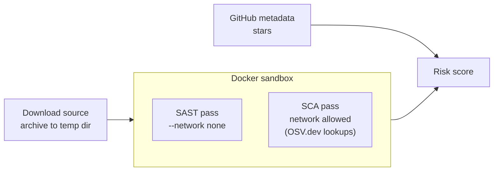

# Security Pre-Download

A CLI that assesses a GitHub-hosted package's risk before you pull it into your
project...not just by checking GitHub metadata, but by actually downloading the
source and scanning it inside a locked-down, ephemeral sandbox, so untrusted code
never touches your machine directly.

## How it works



1. **Metadata check** — queries the GitHub API for the repo's star count
   ([internal/fetchmeta](internal/fetchmeta)).
2. **Download** — pulls the repo's default-branch tarball into a fresh temp
   directory, capped at 200MB so an oversized archive can't fill your disk
   ([internal/fetcharchive](internal/fetcharchive)).
3. **Sandboxed scan** — runs [vulnscan](https://github.com/mollymaefraser/vulnscan)
   (a Rust SCA/SAST scanner) against the downloaded archive inside a hardened,
   ephemeral Docker container: read-only root filesystem, non-root user, all
   capabilities dropped, `no-new-privileges`, memory/PID limits
   ([internal/sandbox](internal/sandbox)). The scan runs as two isolated
   passes, not one:
   - **SAST pass** — `--network none`. This is the pass that touches untrusted
     file contents most directly (regex matching over extracted source), so it
     gets zero network egress.
   - **SCA pass** — network allowed, since vulnscan checks each dependency it
     finds against [OSV.dev](https://osv.dev).

   ([internal/vulnscan](internal/vulnscan))
4. **Score** — GitHub metadata and scan findings are combined into a 0–100 risk
   score with a line-by-line breakdown
   ([internal/assessrisk](internal/assessrisk)).

## Installation

### Prerequisites
- Go 1.22+
- [Docker](https://www.docker.com/) — required for the sandboxed scan step; the
  tool still runs metadata-only with `--no-scan` if Docker isn't available
- Optional: a `GITHUB_TOKEN` environment variable. GitHub's REST API caps
  unauthenticated requests at 60/hour per IP; with a token, 5,000/hour. Each
  full risk-check makes two GitHub API calls (metadata + tarball), so this
  matters if you're running it repeatedly.

```sh
git clone https://github.com/mollymaefraser/security-predownload.git
cd security-predownload
```

## Usage

```sh
go run cmd/risk-check/main.go risk-check <repository-owner> <repository-name> [--no-scan]
```

Full scan against a real repo:
```
$ go run cmd/risk-check/main.go risk-check pallets flask
Assessing risk for package: flask

📊 **Risk Breakdown**
-20: 4 vulnerable dependencies found (SCA)
-30: 2 CRITICAL severity SAST finding(s)
(vulnerability deduction capped at -40, raw total was -50)

🔎 Final Risk Score for flask: **60/100**
```

Metadata-only, no Docker required:
```
$ go run cmd/risk-check/main.go risk-check octocat Hello-World --no-scan
Assessing risk for package: Hello-World

📊 **Risk Breakdown**
Skipped sandboxed vulnerability scan (--no-scan)

🔎 Final Risk Score for Hello-World: **100/100**
```

## Scoring model

Starts at 100 and deducts:

| Factor | Deduction |
|---|---|
| Fewer than 100 GitHub stars | -20 |
| Each vulnerable dependency (SCA finding) | -5 |
| Each CRITICAL SAST finding | -15 |
| Each HIGH SAST finding | -10 |
| Each MEDIUM SAST finding | -5 |
| Each LOW SAST finding | -2 |

The combined SCA + SAST deduction is capped at -40, so one dependency tree
with a long tail of known CVEs can't single-handedly zero out the score.

## Design decisions & trade-offs

- **Docker sandbox, not a bare temp directory.** Downloaded source is
  untrusted by definition. A plain temp folder gives it full access to the
  host; the sandbox constrains what it can touch and where it can talk to,
  independent of whether vulnscan's own parsing is bug-free.
- **Two sandbox passes instead of one.** A single `--network none` container
  would break SCA, which needs to reach OSV.dev. Splitting SAST (fully
  isolated) from SCA (network allowed only for OSV lookups) keeps the
  network-isolated pass (the one actually parsing untrusted file content)
  as locked-down as possible, rather than granting network access to
  everything for the sake of one feature.
- **vulnscan is consumed as an external binary, not reimplemented in Go.**
  It's my own existing Rust tool; the sandbox boundary means this repo
  doesn't need to trust or vet its internals beyond running it isolated.
- **Score deductions are capped.** Uncapped, a large dependency tree could
  zero out the score on volume alone rather than severity, which would make
  the score less informative, not more.

### Known limitations
- Requires Docker; there's no OS-level fallback sandbox (e.g. `sandbox-exec`,
  bubblewrap).
- Isolation is container-level (Linux namespaces/cgroups via Docker), not
  hypervisor-level (gVisor, Firecracker) so a container escape isn't ruled out.
- `docker/vulnscan.Dockerfile` builds whatever the latest GitHub Release of
  vulnscan is at build time, not a pinned commit. Reproducible builds are
  traded for always testing against current vulnscan. `docker build --no-cache`
  is needed to pick up a release that shipped after the image was last built.
- vulnscan's own limitations carry through: `pom.xml` SCA parsing is
  best-effort regex, and SAST rules match line-by-line without
  comment-stripping or string-literal awareness.

## Testing

```sh
go test ./...
```

Every package has unit test coverage, including the pre-existing packages
this feature builds on top of. None of the tests require Docker or real
network access. HTTP-dependent code is tested against `httptest` servers,
and the Docker-invoking parts of `internal/sandbox` and `internal/vulnscan`
have their pure logic (argument construction, report merging, path
resolution) factored out and tested directly.

## Project layout

```
cmd/risk-check/        CLI entrypoint (cobra)
internal/fetchmeta/     GitHub repo metadata (stars)
internal/fetcharchive/  Downloads a repo's source tarball
internal/githubauth/    Optional GITHUB_TOKEN auth header
internal/sandbox/       Hardened, ephemeral Docker container runner
internal/vulnscan/      Runs vulnscan in the sandbox, parses its report
internal/assessrisk/    Combines metadata + scan findings into a score
docker/                 Dockerfile that builds the vulnscan sandbox image
```

## Contributing
Contributions are welcome! Feel free to open an issue or submit a pull request.

## License
This project is licensed under the MIT License.
